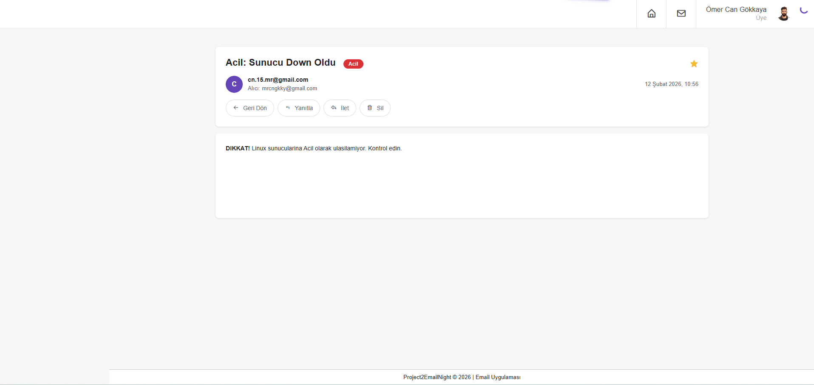
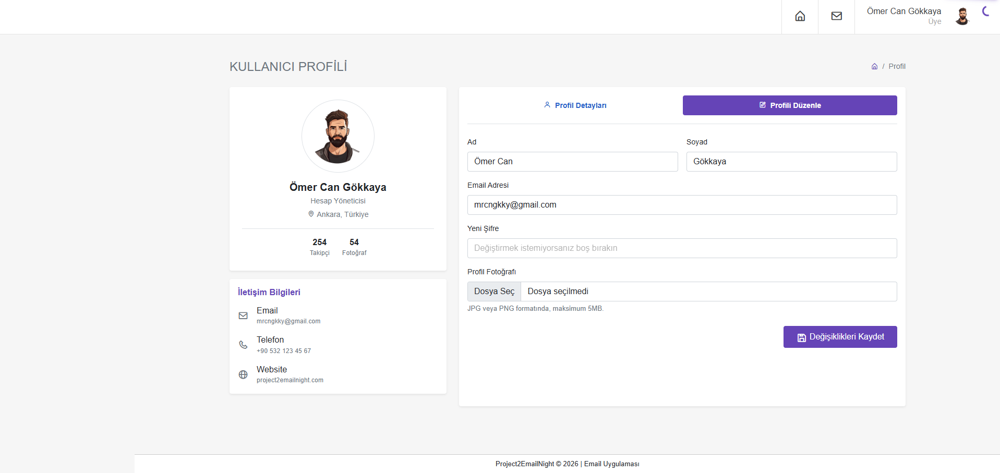
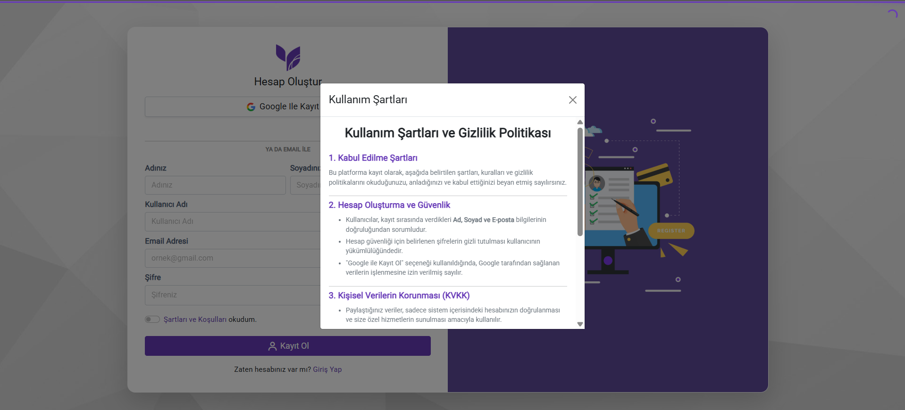
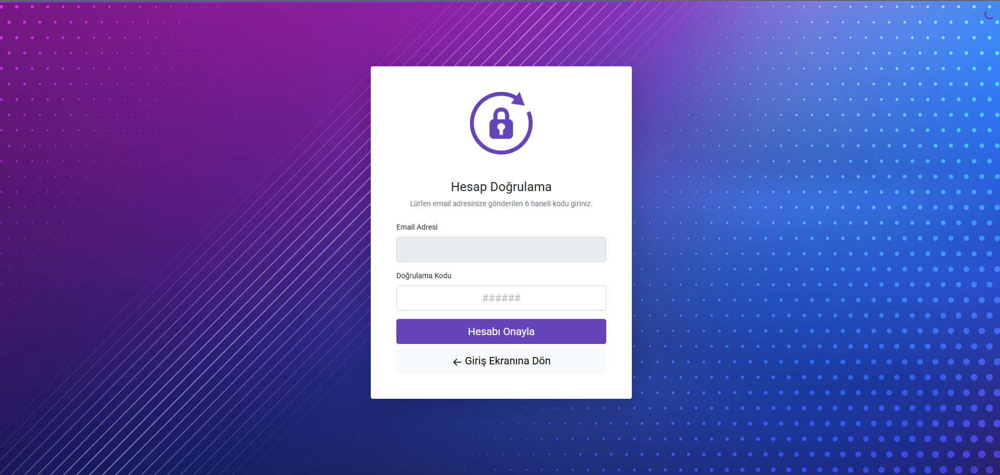
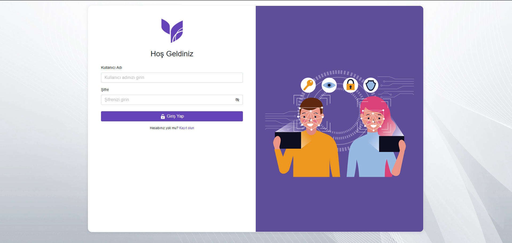

# 📧 EmailNight - Modern E-posta Yönetim Platformu

**EmailNight**, ASP.NET Core 8.0 MVC mimarisi kullanılarak geliştirilmiş, Gmail benzeri modern bir e-posta yönetim platformudur. Kullanıcıların güvenli şekilde mesajlaşmasını sağlarken, akıllı kategorizasyon, dosya yönetimi ve otomatik taslak kaydetme gibi gelişmiş özellikler sunar.

---

## 🎯 Projenin Amacı

Kullanıcıların güvenli bir ortamda birbirleriyle iletişim kurmasını sağlamak, mesaj trafiğini otomatik olarak kategorize ederek (İş, Eğitim, Acil, Sosyal) yönetmek ve tüm bu süreci modern, analitik bir arayüz üzerinden sunmaktır.

Bu proje, gerçek dünya e-posta sistemlerinin temel işlevlerini simüle ederken, **Clean Code** ve **MVC** prensiplerine sadık kalır.

---

## 📸 Ekran Görüntüleri

Projenin öne çıkan arayüz tasarımları:

### 📊 Dashboard & Genel Bakış
| **Genel İstatistikler** | **Son Aktiviteler & İşlemler** |
|:-------------------:|:---------------------------:|
|  |  |
| *Anlık sayaçlar ve grafikler* | *Son gelen mailler ve hızlı menü* |

### 📨 Mesajlaşma Deneyimi
| **📬 Gelen Kutusu (Inbox)** | **📝 Yeni Mesaj Oluşturma** |
|:-----------------------:|:-------------------------:|
|  |  |
| *Kategorili ve filtreli mesaj listesi* | *HTML editör ve dosya yükleme* |

### 🔍 Detaylar & Filtreleme
| **📂 Mesaj İçeriği** | **⭐ Yıldızlı Mesajlar** |
|:------------------:|:--------------------:|
|  |  |
| *Mesaj Detayı* | *Favorilenen önemli iletiler* |

### 👤 Profil Yönetimi
| **🧑‍💼 Kullanıcı Profili** | **⚙️ Profil Düzenleme** |
|:--------------------:|:--------------------:|
|  |  |
| *Kişisel bilgiler ve yetenek grafikleri* | *Kullanıcı bilgileri güncelleme formu* |

### 🔐 Üyelik & Güvenlik Süreçleri
| **📝 Kayıt Ekranı** | **⚖️ Kullanım Şartları** |
|:--------------------:|:-----------------------:|
|  |  |
| *Güvenli kayıt formu* | *Kayıt öncesi onay politikaları* |

| **🛡️ 2FA / OTP Doğrulama** | **🚪 Giriş Ekranı** |
|:-----------------------:|:-----------------------:|
|  |  |
| *MailKit entegrasyonu ile 6 haneli doğrulama* | *Kullanıcı Giriş ekranı* |

---

## ⭐ Öne Çıkan Özellikler

### 📊 1. Dinamik Dashboard
- **6 İstatistik Kartı:** Toplam Mail, Gelen Kutusu, Gönderilen, Okunmamış, Taslak, Yıldızlı
- **Gerçek Zamanlı Takip:** Anlık mesaj istatistikleri
- **Son Aktiviteler:** En son 5 mesajın özet listesi
- **Hızlı Erişim:** Sidebar menü ile tek tıkla navigasyon
- **Kategori Dağılımı:** Mesajların kategorilere göre dağılımı

### 🏷️ 2. Akıllı Kategorizasyon Sistemi
Sistem, mesaj konusunu (Subject) otomatik analiz eder ve uygun kategoriyi atar:

| Kategori | Renk | Tetikleyici Kelimeler |
|----------|------|----------------------|
| 🟣 **İş** | Mor | iş, toplantı, proje |
| 🔴 **Acil** | Kırmızı | acil, urgent |
| 🟠 **Eğitim** | Turuncu | eğitim, kurs, ders |
| 🔵 **Sosyal** | Mavi | sosyal, etkinlik |
| ⚪ **Genel** | Gri | Diğer tüm mesajlar |

**Özellikler:**
- Türkçe karakter duyarlılığı (`ToLowerInvariant()`)
- Otomatik renk kodlaması
- Badge ile görsel ayrıştırma

### 📧 3. Gelişmiş Mesaj Yönetimi

#### 📥 Gelen Kutusu (Inbox)
- Okunmuş/Okunmamış mesaj ayrımı (Bold/Normal font)
- Sayfalama ile performans optimizasyonu (50 mesaj/sayfa)
- Kategori badge'leri
- Yıldızlama özelliği
- Toplu seçim ve silme

#### 📤 Giden Kutusu (Sendbox)
- Gönderilen tüm mesajların listesi
- Arama ve filtreleme
- Detay görüntüleme

#### 📝 Taslaklar (Drafts)
- **Otomatik Kaydetme:** Her 3 saniyede bir otomatik kaydedilir
- **Manuel Kaydetme:** "Taslak Kaydet" butonu
- **Dosya Desteği:** Taslaklar dosyalarıyla birlikte kaydedilir
- **Kaldığınız Yerden Devam:** Taslakları düzenleyerek gönderebilirsiniz

#### ⭐ Yıldızlı Mesajlar
- Favori mesajlarınızı işaretleyin
- Hızlı erişim için filtreleyin
- AJAX ile anlık güncelleme

#### ⏰ Ertelenenler (Snoozed)
- Mesajları belirlediğiniz saate kadar erteleyin
- 1, 4, 8, 24 saat seçenekleri
- Zamanı gelince otomatik görünür

### 📎 4. Dosya Yönetimi
- **Çoklu Dosya Ekleme:** 10 dosyaya kadar ekleme
- **Boyut Limiti:** Dosya başına max 10MB
- **Otomatik Hesaplama:** Dosya boyutu KB/MB olarak gösterilir
- **Güvenli Depolama:** Her kullanıcı için ayrı klasör
- **Kolay İndirme:** Tek tıkla dosya indirme
- **Görsel Gösterim:** Dosya ikonu ve detayları

### 🔍 5. Arama ve Filtreleme
- **Gelişmiş Arama:** Konu, içerik ve gönderen bazında
- **Durum Filtreleme:** Okundu, Okunmadı, Yıldızlı
- **Kategori Filtreleme:** İş, Eğitim, Acil, Sosyal
- **Klasör Bazlı:** Gelen, Gönderilen, Taslak, Yıldızlı

### 🔐 6. Güvenlik & Identity
- **ASP.NET Core Identity:** Profesyonel kullanıcı yönetimi
- **Şifreli Oturum:** Cookie-based authentication
- **SQL Injection Koruması:** Parametreli sorgular
- **XSS Koruması:** HTML sanitization
- **CSRF Koruması:** Anti-forgery token

### 🎨 7. Modern Kullanıcı Arayüzü
- **Gmail-Inspired Tasarım:** Temiz ve profesyonel görünüm
- **Responsive Layout:** Her cihazda mükemmel görünüm
- **Smooth Animasyonlar:** Hover efektleri ve geçişler
- **Dark/Light Theme Ready:** Kolay tema entegrasyonu
- **Rich Text Editor:** Summernote ile HTML formatında yazma
  - Bold, Italic, Underline
  - Listeler ve bağlantılar
  - Resim ekleme (base64)

### 🧑‍💼 8. Profil Yönetimi
- Kullanıcı bilgilerini güncelleme
- Profil fotoğrafı yükleme
- Ad, Soyad, Email bilgileri

---

## 📂 Proje Yapısı
```bash
Project2EmailNight/
│
├── 📁 Controllers/           # Uygulama akışı ve HTTP istekleri
│   ├── DashboardController.cs    # Dashboard işlemleri
│   ├── MessageController.cs      # Mesaj CRUD işlemleri
│   ├── LoginController.cs        # Giriş/Çıkış
│   └── ProfileController.cs      # Profil yönetimi
│
├── 📁 Entities/              # Veritabanı modelleri
│   ├── AppUser.cs                # Kullanıcı entity'si
│   ├── Message.cs                # Mesaj entity'si
│   └── MessageAttachment.cs      # Dosya entity'si
│
├── 📁 Context/               # Veritabanı bağlantısı
│   └── EmailContext.cs           # DbContext sınıfı
│
├── 📁 Dtos/                  # Veri transfer objeleri
│   └── CreateMessageDto.cs       # Mesaj oluşturma DTO'su
│
├── 📁 Migrations/            # Code-First migrations
│   └── [Timestamp]_InitialCreate.cs
│
├── 📁 Views/                 # Razor view dosyaları
│   ├── 📁 Dashboard/
│   │   └── Index.cshtml          # Dashboard sayfası
│   ├── 📁 Message/
│   │   ├── Inbox.cshtml          # Gelen kutusu
│   │   ├── Sendbox.cshtml        # Giden kutusu
│   │   └── Details.cshtml        # Mesaj detayı
│   ├── 📁 Login/
│   │   ├── UserLogin.cshtml      # Giriş ekranı
│   │   └── UserRegister.cshtml   # Kayıt ekranı
│   └── 📁 Shared/
│       └── _Layout.cshtml        # Ana layout
│
└── 📁 wwwroot/               # Statik dosyalar
    ├── 📁 assets/                # CSS, JS, Images
    └── 📁 uploads/
        └── 📁 attachments/       # Yüklenen dosyalar
```

---


### 📋 Tablo Detayları

**AppUser** (Identity)
- Kullanıcı bilgileri
- Identity ile otomatik yönetilir

**Message**
- Tüm mesaj bilgileri
- Kategori ve durum bilgileri

**MessageAttachment**
- Dosya ekleri
- Message ile 1:N ilişki

---

## 📖 Kullanım Kılavuzu

### 1️⃣ Kayıt Olma
- Ana sayfada "Kayıt Ol" butonuna tıklayın
- Ad, Soyad, Email ve Şifre bilgilerinizi girin
- "Kayıt Ol" butonuna basın

### 2️⃣ Giriş Yapma
- Email ve şifrenizle giriş yapın
- Dashboard'a yönlendirileceksiniz

### 3️⃣ Mesaj Gönderme
- "Oluştur" butonuna tıklayın
- Alıcı email, konu ve içerik girin
- İsterseniz dosya ekleyin
- "Gönder" veya "Taslak Kaydet" seçin

### 4️⃣ Mesajları Yönetme
- Gelen kutusunda mesajları görüntüleyin
- Yıldızlama, silme, filtreleme yapın
- Kategorilere göre ayırın

---

## 🎓 Öğrendiklerim

Bu proje sürecinde kazandığım teknik bilgiler:

✅ **.NET 8.0 MVC Mimarisi** - Controller, View, Model ayrımı  
✅ **Entity Framework Core** - Code-First, Migrations, LINQ  
✅ **ASP.NET Identity** - Kullanıcı yönetimi ve güvenlik  
✅ **AJAX & jQuery** - Asenkron işlemler  
✅ **Responsive Web Tasarım** - Bootstrap kullanımı  
✅ **Dosya Yönetimi** - Upload, download, storage  
✅ **Pagination** - Performans optimizasyonu  
✅ **Clean Code** - Okunabilir ve sürdürülebilir kod  

---

## 🙏 Teşekkürler

Bu projeyi geliştirme sürecinde:
- **Murat Yücedağ** hocama rehberliği için
- **M&Y Yazılım Eğitim Akademi** ailesine destekleri için

Teşekkür ederim! 🎓


---


<div align="center">

### ⭐ Bu projeyi beğendiyseniz yıldızlamayı unutmayın!

**EmailNight** © 2026 - Tüm hakları saklıdır.

Made with ❤️ by [Ömer Can]

</div>
